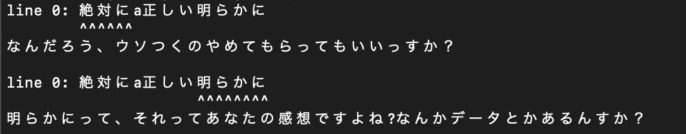
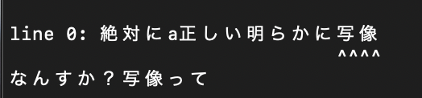

# hiroyukilint
[](https://github.com/jiko21/hiroyukilint/actions/workflows/ci-test.yml)
[](https://github.com/jiko21/hiroyukilint/actions/workflows/ci-releaser.yml)

論破されそうな語句があれば指摘するlinter
## 概要
> 概要を概要であると見抜ける人でないと(`hiroyukilint`を使うのは)難しい

`明らかに`や`必ず`のような、ひろゆきに論破されそうな単語が文章中に存在すると以下のように警告してくれます



## 実行方法
> 実行方法を実行方法であると見抜ける人でないと(`hiroyukilint`を使うのは)難しい

```bash
hiroyukilint <チェックしたいファイル> -b <使ってはいけない単語リスト>
```

## 使ってはいけない単語リストについて
> 使ってはいけない単語リストを使ってはいけない単語リストであると見抜ける人でないと(`hiroyukilint`を使うのは)難しい

ひろゆき氏の名言
> なんすか、しゃぞーって？
にあやかって、使ってはいけない単語をブラックリストとして指定できます。

`-b` `--blacklists`で単語リストを指定してください。

なお、単語リストは以下のようなテキストで記述可能です

```
# #で始まる行は無視されます
写像
しゃぞー
```

### 実行サンプル

